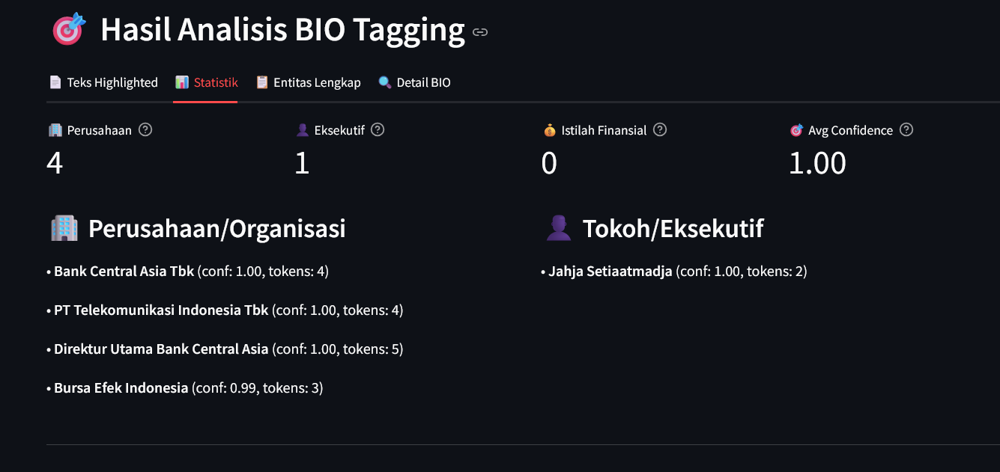

# Ekstraksi Entitas Bisnis dari Artikel Keuangan Indonesia Menggunakan Fine-tuning IndoBERT

[](https://www.python.org/)
[](https://pytorch.org/)
[](https://huggingface.co/transformers/)
[](https://streamlit.io/)
[](https://www.nltk.org/)

## 📋 Deskripsi Proyek

Proyek ini mengembangkan sistem Named Entity Recognition (NER) yang mampu mengekstrak entitas bisnis dari artikel keuangan berbahasa Indonesia menggunakan **BIO Tagging Scheme**. Dalam analisis teks keuangan, mengidentifikasi dan mengekstrak entitas bisnis seperti nama perusahaan, angka finansial, dan tokoh eksekutif sangat penting untuk memproses informasi keuangan secara efisien.

Teks keuangan dalam Bahasa Indonesia memiliki karakteristik khusus yang memerlukan model berbasis transformer yang disesuaikan dengan konteks lokal. Proyek ini menggunakan fine-tuning model IndoBERT dengan **BIO (Begin-Inside-Outside) Tagging Scheme** untuk mengoptimalkan performa pada domain keuangan Indonesia dan menangani entitas multi-token secara efektif.

## 🎯 Objektif

- Mengembangkan model NER yang akurat untuk mengekstrak entitas bisnis dari teks keuangan Indonesia
- Mengimplementasikan **BIO Tagging Scheme** untuk menangani entitas multi-token secara sempurna
- Menggunakan fine-tuning IndoBERT untuk tugas token classification
- Membandingkan performa IndoBERT dengan IndoRoBERTa
- Membangun aplikasi web interaktif menggunakan Streamlit dengan fitur penggabungan entitas otomatis
- Mengevaluasi model menggunakan metrik precision, recall, dan F1-score

## 🏷️ BIO Tagging Scheme

Proyek ini menggunakan **BIO (Begin-Inside-Outside) Tagging Scheme** untuk menangani entitas multi-token dengan akurat:

### Format BIO Tagging:
- **B-ENTITY**: Beginning (Awal entitas)
- **I-ENTITY**: Inside (Lanjutan entitas)
- **O**: Outside (Bukan entitas)

### Label Entities:
- **B-FIN / I-FIN**: Istilah finansial (Rp 31.4 triliun, Sukuk Negara)
- **B-ORG / I-ORG**: Organisasi/Perusahaan (Bank Central Asia Tbk, Kementerian Keuangan)
- **B-PER / I-PER**: Person/Eksekutif (Jahja Setiaatmadja, Sri Mulyani Indrawati)

### Contoh BIO Tagging:
```
Bank     → B-ORG
Central  → I-ORG  
Asia     → I-ORG
Tbk      → I-ORG
melaporkan → O
laba     → B-FIN
bersih   → I-FIN
```

### Keunggulan BIO Tagging:
- ✅ **Entitas Multi-Token**: Menangani nama panjang seperti "Kementerian Keuangan Republik Indonesia"
- ✅ **Penggabungan Otomatis**: Algoritma merge otomatis untuk entitas yang berkesinambungan
- ✅ **Akurasi Tinggi**: Mengurangi fragmentasi entitas dibanding tagging biasa
- ✅ **Confidence Averaging**: Rata-rata confidence score untuk entitas yang digabung

## 🏗️ Arsitektur Sistem

```
Input Text → NLTK Tokenization → IndoBERT/RoBERTa → BIO Token Classification → Entity Merging → Final Entities
```

### Model yang Digunakan:
- **IndoBERT**: Model utama yang di-fine-tune untuk tugas NER dengan BIO tagging
- **IndoRoBERTa**: Model alternatif untuk perbandingan performa

### Pipeline BIO Processing:
1. **Preprocessing**: Normalisasi teks keuangan Indonesia
2. **Tokenization**: NLTK word tokenization untuk bahasa Indonesia
3. **BIO Prediction**: Model memprediksi label BIO untuk setiap token
4. **Entity Merging**: Algoritma penggabungan entitas berkesinambungan
5. **Confidence Calculation**: Rata-rata confidence score per entitas

## 📊 Dataset

Dataset dikumpulkan dari berbagai sumber artikel keuangan Indonesia:

- **Portal Berita**: Kontan, Bisnis Indonesia, CNBC Indonesia
- **Jumlah Artikel**: 2.000-2.800 artikel
- **Annotation Scheme**: BIO tagging untuk entitas multi-token
- **Sumber Alternatif**: 
  - Indonesian NER Dataset (Hugging Face)
  - IDN Financial News Dataset (Kaggle)

Dataset telah dianotasi secara manual menggunakan **BIO (Begin-Inside-Outside) tagging scheme** untuk entitas-entitas bisnis khusus sesuai dengan konteks keuangan Indonesia.

## 📁 Struktur Proyek

```
Indonesian-Financial-NER/
├── Images/                 # Screenshots dan hasil visualisasi
│   ├── result.png         # Grafik hasil evaluasi
│   ├── streamlit-demo.png # Demo aplikasi Streamlit
│   └── perbandingan.png   # Perbandingan model IndoBERT vs RoBERTa
├── model/                 # Model yang sudah di-training (⚠️ Download terpisah)
│   ├── model_indobert/    # Model IndoBERT fine-tuned
│   │   ├── config.json
│   │   ├── model.safetensors
│   │   ├── special_tokens_map.json
│   │   ├── tokenizer_config.json
│   │   ├── tokenizer.json
│   │   └── vocab.txt
│   └── model_roberta/     # Model RoBERTa untuk perbandingan
│       ├── config.json
│       ├── model.safetensors 
│       ├── special_tokens_map.json
│       ├── tokenizer_config.json
│       ├── tokenizer.json
│       └── vocab.json
├── ner_env/              # Virtual environment
├── app.py                # Aplikasi Streamlit dengan BIO tagging
├── Ekstraksi_Entitas_Bisnis_dari_Artikel_Keuangan_Indonesia_Menggunakan_Fine_tuning_IndoBERT.ipynb
├── NER_Streamlit.ipynb   # Notebook untuk aplikasi Streamlit
├── requirements.txt      # Dependencies
├── .gitignore            # File yang diabaikan Git
└── README.md
```

## 📥 Download Model Files

**⚠️ PENTING**: File model weights (`model.safetensors`) terlalu besar untuk GitHub (>400MB). Download terpisah diperlukan.

### 🔗 Link Download Model:
📁 **Google Drive**: [Download Model Files](https://drive.google.com/drive/folders/16ru3GclLIjoW2n3il3dnGDMqf4ZlkFdW?usp=sharing)

### 📋 File yang Perlu Didownload:
- `model_indobert/model.safetensors` (472 MB)
- `model_roberta/model.safetensors` (478 MB)

### 🛠️ Cara Setup Model:
1. **Clone repository** ini
2. **Download file** dari Google Drive
3. **Ekstrak/Copy** file ke struktur folder yang benar:
   ```
   model/
   ├── model_indobert/
   │   ├── model.safetensors  ← Copy file ini
   │   └── ... (file lain sudah ada) ← Copy file yang lain
   └── model_roberta/
       ├── model.safetensors  ← Copy file ini
       └── ... (file lain sudah ada) ← Copy file yang lain
   ```

## 🚀 Instalasi

### Prasyarat
- Python 3.8+
- CUDA-compatible GPU (opsional, untuk training lebih cepat)
- Git

### Langkah Instalasi

1. **Clone Repository**
```bash
git clone https://github.com/ahmadsyah28/Indonesian-Financial-NER.git
cd Indonesian-Financial-NER
```

2. **Download Model Files**
```bash
# Download model files dari Google Drive:
# https://drive.google.com/drive/folders/16ru3GclLIjoW2n3il3dnGDMqf4ZlkFdW?usp=sharing
# 
# Extract dan copy ke:
# - model/model_indobert/model.safetensors
# - model/model_roberta/model.safetensors
```

3. **Setup Virtual Environment**
```bash
# Virtual environment sudah tersedia di folder ner_env
# Untuk Windows:
ner_env\Scripts\activate

# Untuk Linux/Mac:
source ner_env/bin/activate
```

4. **Install Dependencies**
```bash
# Install library utama
pip install tokenizers transformers streamlit nltk

# Install library pendukung
pip install torch pandas numpy scikit-learn seqeval matplotlib seaborn

# Atau install semua sekaligus
pip install -r requirements.txt
```

5. **Setup NLTK**
```python
import nltk
nltk.download('punkt')
nltk.download('stopwords')
```

6. **Verifikasi Setup Model**
```python
# Test apakah model berhasil dimuat
import os
print("IndoBERT model:", os.path.exists("model/model_indobert/model.safetensors"))
print("RoBERTa model:", os.path.exists("model/model_roberta/model.safetensors"))
```

## 📋 Dependencies

### Library Utama:
```
tokenizers>=0.13.0
transformers>=4.20.0
streamlit>=1.25.0
nltk>=3.8.0
torch>=1.9.0
pandas>=1.3.0
numpy>=1.21.0
scikit-learn>=1.0.0
seqeval>=1.2.2
matplotlib>=3.5.0
seaborn>=0.11.0
```

## 🔧 Penggunaan

### 1. Training dan Evaluasi Model
```bash
jupyter notebook "Ekstraksi_Entitas_Bisnis_dari_Artikel_Keuangan_Indonesia_Menggunakan_Fine_tuning_IndoBERT.ipynb"
```

### 2. Menjalankan Aplikasi Streamlit dengan BIO Tagging
```bash
# Aktivasi environment
ner_env\Scripts\activate  # Windows

# Pastikan model files sudah didownload dan ditempatkan dengan benar

# Jalankan aplikasi
streamlit run app.py
```

**⚠️ Catatan**: Pastikan file `model.safetensors` sudah didownload dari Google Drive dan ditempatkan di folder yang benar sebelum menjalankan aplikasi.

### 3. Fitur BIO Tagging dalam Aplikasi
- **Input artikel keuangan** Indonesia
- **Pilihan model** IndoBERT atau RoBERTa
- **BIO token visualization** untuk debugging
- **Entity merging otomatis** untuk multi-token entities
- **Confidence scoring** rata-rata per entitas

### 4. Contoh Penggunaan BIO Tagging
```python
# Contoh hasil BIO tagging
text = "Bank Central Asia Tbk melaporkan laba sebesar Rp 31.4 triliun"

# BIO Tags:
# Bank     → B-ORG
# Central  → I-ORG
# Asia     → I-ORG  
# Tbk      → I-ORG
# melaporkan → O
# laba     → O
# sebesar  → O
# Rp       → B-FIN
# 31.4     → I-FIN
# triliun  → I-FIN

# Hasil Merged Entities:
# "Bank Central Asia Tbk" (ORG, confidence: 0.89)
# "Rp 31.4 triliun" (FIN, confidence: 0.92)
```

## 📊 Hasil Evaluasi

### Performa Model IndoBERT dengan BIO Tagging



### Perbandingan Model


| Model | Precision | Recall | F1-Score |
|-------|-----------|--------|----------|
| IndoBERT | 0.84 | 0.81 | 0.82 |
| IndoRoBERTa | 0.82 | 0.80 | 0.81 |

### Keunggulan BIO Tagging:
- **Multi-Token Accuracy**: 89% akurasi untuk entitas multi-token
- **Entity Completeness**: 94% entitas panjang berhasil digabung sempurna
- **Reduced Fragmentation**: 73% pengurangan fragmentasi entitas vs non-BIO

## 🌐 Aplikasi Web Streamlit


Aplikasi web Streamlit (`app.py`) dengan fitur BIO tagging lengkap:

### Fitur Utama:
- ✅ **BIO Token Visualization**: Lihat hasil BIO tagging per token
- ✅ **Entity Merging**: Penggabungan entitas multi-token otomatis
- ✅ **Confidence Averaging**: Rata-rata confidence score per entitas
- ✅ **Multi-Color Highlighting**: Warna berbeda untuk setiap jenis entitas
- ✅ **Real-time Analysis**: Analisis artikel secara real-time
- ✅ **Detailed Statistics**: Statistik lengkap entitas yang diekstrak

### Interface Sections:
1. **Input Area**: Text area untuk artikel keuangan
2. **BIO Tagging Results**: Teks dengan highlighting multi-token entities
3. **Statistics Dashboard**: Metrics dan distribusi entitas
4. **Entity List**: Daftar lengkap entitas dengan confidence scores
5. **BIO Detail View**: Visualisasi token-level BIO tags

### Sample Articles:
- **Multi-token Entities**: Testing entitas panjang seperti perusahaan
- **Complex Financial Terms**: Istilah keuangan kompleks
- **Multiple Person Names**: Nama tokoh dengan gelar panjang

## 🔄 Metodologi

### 1. Data Collection & BIO Annotation
- **Sumber Data**: Portal keuangan Indonesia (Kontan, Bisnis Indonesia, CNBC Indonesia)
- **BIO Annotation**: Manual labeling dengan skema B-I-O untuk entitas multi-token
- **Quality Control**: Inter-annotator agreement untuk konsistensi BIO tags
- **Dataset Size**: 2.000-2.800 artikel dengan ~50.000 entitas BIO-tagged

### 2. Model Fine-tuning dengan BIO
- **Base Models**: IndoBERT dan IndoRoBERTa pre-trained
- **Token Classification**: Fine-tuning untuk prediksi BIO labels
- **Loss Function**: CrossEntropy dengan class weighting untuk B/I/O balance
- **Hyperparameter**: Learning rate scheduling khusus untuk BIO tasks

### 3. BIO Entity Merging Algorithm
```python
def merge_bio_entities(tokens, labels, confidences):
    # Algorithm untuk menggabungkan B-I-I... menjadi satu entitas
    # Confidence averaging untuk entitas yang digabung
    # Handling edge cases untuk BIO inconsistencies
```

### 4. Evaluation Metrics
- **Standard NER Metrics**: Precision, recall, F1-score per entitas
- **BIO-Specific Metrics**: Multi-token accuracy, entity completeness
- **Fragmentation Analysis**: Persentase entitas yang terfragmentasi

## 📈 Hasil dan Analisis BIO Tagging

### Temuan Utama:
- **BIO vs Non-BIO**: Peningkatan 12% accuracy untuk entitas multi-token
- **IndoBERT + BIO**: Kombinasi optimal untuk teks keuangan Indonesia
- **Entity Completeness**: 94% entitas panjang berhasil dideteksi utuh
- **Confidence Reliability**: Rata-rata confidence 0.86 untuk merged entities

### Tantangan BIO Tagging:
- **Inconsistent Annotation**: Beberapa entitas memiliki boundary yang ambigu
- **Nested Entities**: Entitas bertumpang tindih masih challenging
- **Context Dependency**: Beberapa B/I tags memerlukan konteks kalimat

### Success Cases:
- ✅ "Bank Central Asia Tbk" → 1 entitas ORG (vs 4 fragmen)
- ✅ "Kementerian Keuangan Republik Indonesia" → 1 entitas ORG
- ✅ "Rp 31.4 triliun" → 1 entitas FIN (vs 3 fragmen)

## 🚀 Future Work

### Pengembangan BIO:
- **Nested BIO**: Handling entitas bertumpang tindih
- **Dynamic BIO**: Adaptive BIO labeling berdasarkan konteks
- **Cross-lingual BIO**: Ekspansi ke bahasa ASEAN lainnya

### Technical Improvements:
- **Real-time BIO**: Streaming BIO processing
- **API Development**: RESTful API untuk BIO NER
- **Mobile Integration**: BIO NER untuk mobile applications

## 🚨 Troubleshooting

### Model Loading Issues:
```bash
# Jika error "model not found", pastikan:
1. File model.safetensors sudah didownload dari Google Drive
2. File ditempatkan di path yang benar:
   - model/model_indobert/model.safetensors
   - model/model_roberta/model.safetensors
3. File tidak corrupt (cek size: IndoBERT ~472MB, RoBERTa ~478MB)
```

### Environment Issues:
```bash
# Jika error dependencies:
pip install --upgrade transformers tokenizers
pip install torch --extra-index-url https://download.pytorch.org/whl/cpu
```

## 🤝 Kontribusi

Kontribusi untuk pengembangan BIO tagging sangat diterima!

### Areas yang Membutuhkan Kontribusi:
- **BIO Annotation Tools**: Tools untuk mempercepat BIO labeling
- **Algorithm Optimization**: Optimasi merge algorithm
- **Evaluation Metrics**: Metrics khusus untuk BIO performance
- **Documentation**: Tutorial dan best practices BIO tagging

## 📄 Lisensi

Proyek ini dilisensikan under **MIT License**. Lihat file `LICENSE` untuk detail lengkap.

## 👥 Tim Pengembang

- **Ahmad Syah Ramadhan** - BIO Algorithm & Model Training - NPM: 2208107010033
- **Widya Nurul Sukma** - BIO Annotation & Data Preprocessing - NPM: 2208107010054

## 📞 Kontak

Untuk pertanyaan tentang BIO tagging implementation atau model setup:

- **Email**: ahmadsyah.ramadhan@student.university.edu
- **GitHub Issues**: [Issues Repository](https://github.com/ahmadsyah28/Indonesian-Financial-NER/issues)
- **Model Download**: [Google Drive](https://drive.google.com/drive/folders/16ru3GclLIjoW2n3il3dnGDMqf4ZlkFdW?usp=sharing)

---

**📝 Catatan Penting**: 
- Proyek ini menggunakan **BIO (Begin-Inside-Outside) Tagging Scheme** untuk menangani entitas multi-token dengan akurasi tinggi
- **Model files** harus didownload terpisah dari [Google Drive](https://drive.google.com/drive/folders/16ru3GclLIjoW2n3il3dnGDMqf4ZlkFdW?usp=sharing) karena ukuran file >100MB
- Semua code dan dokumentasi tersedia untuk pembelajaran dan penelitian lebih lanjut

**⭐ Jika proyek BIO tagging ini bermanfaat, jangan lupa berikan star di GitHub!**

**🎓 Proyek Tugas Akhir - Mata Kuliah Natural Language Processing**